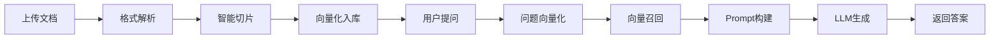

# 企业级RAG文档问答系统

<p align="center">
    
    
    
    
    
</p>

## 📖 项目简介

企业级RAG（检索增强生成）文档问答系统，基于Spring Boot 3.3 + MyBatis-Plus + ChromaDB + 通义千问大模型构建。提供文档上传、智能切片、向量化入库、语义检索、RAG问答全链路能力。

### 核心特性

- 🎯 **RAG全链路**：文档处理 → 向量化 → 语义检索 → LLM生成
- 🔒 **企业级设计**：熔断、重试、限流、缓存、事务一致性
- 📊 **可观测性**：日志切面、异常拦截、响应时间统计
- 🚀 **高性能**：异步处理、线程池隔离、Redis缓存
- 📝 **可维护**：分层架构、配置化设计、完整单元测试

## 🏗️ 技术架构

### 技术栈

| 层级 | 技术选型 | 说明 |
|:---|:---|:---|
| **基础框架** | Spring Boot 3.3.0 | Java 21 LTS |
| **持久层** | MyBatis-Plus 3.5.7 | CRUD+分页+逻辑删除 |
| **向量库** | ChromaDB 0.1.5 | 本地嵌入式向量数据库 |
| **大模型** | 通义千问 qwen3-8b | 阿里云DashScope API |
| **缓存** | Redis | 限流+高频问答缓存 |
| **文档处理** | Apache PDFBox/POI | PDF/Word/文本解析 |

### 项目模块

```
rag-enterprise-doc-qa/
├── rag-common          # 公共模块：异常、结果、日志、配置
├── rag-domain          # 领域模块：实体、枚举、值对象
├── rag-infrastructure  # 基础设施：AI服务、向量库、Redis
├── rag-application     # 应用模块：业务服务、流程编排
└── rag-api             # 接口模块：Controller、DTO、Swagger
```

### 分层架构

```
┌─────────────────────────────────────────────────┐
│                  用户层（User Layer）              │
└──────────────────────┬──────────────────────────┘
                       │
┌──────────────────────▼──────────────────────────┐
│              API层（Controller）                   │
│  DocumentController / QAController               │
│  参数校验、接口文档、统一响应                        │
└──────────────────────┬──────────────────────────┘
                       │
┌──────────────────────▼──────────────────────────┐
│              应用层（Service）                     │
│  DocumentService / QAService                    │
│  业务编排、事务管理、异常处理                        │
└──────────────────────┬──────────────────────────┘
                       │
┌──────────────────────▼──────────────────────────┐
│              基础设施层（Infrastructure）           │
│  QwenLLMService / ChromaDBClient / RedisService│
│  AI调用、向量检索、缓存限流                         │
└──────────────────────┬──────────────────────────┘
                       │
┌──────────────────────▼──────────────────────────┐
│              数据层（Data Layer）                  │
│  MySQL / ChromaDB / Local File                  │
└─────────────────────────────────────────────────┘
```

## 🎯 核心能力

### 1. RAG全链路



### 2. 切片策略（优化版）

- **固定大小**：512字符
- **重叠窗口**：120字符（保证上下文连贯）
- **句子边界**：优先在句号、换行符处切分

### 3. 向量召回策略

- **Top5召回**：向量相似度最高的5个切片
- **阈值过滤**：低于0.75相似度的结果过滤
- **重排序**：按相似度和位置加权

### 4. 容错机制

| 机制 | 实现 | 作用 |
|:---|:---|:---|
| **熔断器** | Resilience4j | LLM调用失败时快速失败 |
| **重试** | Guava Retryer | 自动重试3次，指数退避 |
| **降级** | 知识库原文兜底 | LLM不可用时返回原始文档 |
| **限流** | Redis滑动窗口 | 防止接口被刷 |
| **缓存** | Redis | 高频问答直接返回 |

## 🔧 快速开始

### 环境要求

- JDK 21+
- Maven 3.9+
- MySQL 8.0+
- Redis 7.0+
- ChromaDB（可选，本地嵌入式）

### 配置步骤

**1. 配置环境变量**

```bash
# 设置通义千问API密钥
export aliQwen-api=your-api-key
```

**2. 修改配置文件**

```yaml
# application-dev.yml
spring:
  datasource:
    url: jdbc:mysql://localhost:3306/rag_doc_db
    username: root
    password: your-password
  data:
    redis:
      host: localhost
      port: 6379
```

**3. 初始化数据库**

```bash
mysql -u root -p < rag-infrastructure/src/main/resources/sql/init_tables.sql
```

**4. 启动项目**

```bash
mvn spring-boot:run -pl rag-api
```

**5. 访问接口文档**

```
http://localhost:8080/swagger-ui.html
```

## 📡 API接口

### 文档管理

| 接口 | 方法 | 说明 |
|:---|:---|:---|
| `/api/documents` | POST | 上传文档 |
| `/api/documents` | GET | 文档列表 |
| `/api/documents/{id}` | GET | 文档详情 |
| `/api/documents/{id}/status` | PUT | 更新状态 |
| `/api/documents/{id}` | DELETE | 删除文档 |

### 智能问答

| 接口 | 方法 | 说明 |
|:---|:---|:---|
| `/api/qa/ask` | POST | 智能问答 |
| `/api/qa/history` | GET | 问答历史 |

## 🏆 项目亮点

### 技术亮点

| 亮点 | 说明 |
|:---|:---|
| **切片策略优化** | 512字符+120重叠窗口+句子边界切分 |
| **向量召回质量控制** | 动态阈值0.75，过滤无效召回 |
| **线程池隔离** | fileParserPool/aiCallPool/scheduledPool |
| **熔断+重试+降级** | 三层容错保障服务稳定性 |
| **高频问答缓存** | Redis缓存节省API调用费用 |
| **联动删除机制** | 文档删除时同步清理向量库脏数据 |

### 架构亮点

- **分层清晰**：Controller→Service→Manager→DAO→CoreAI
- **配置化设计**：所有阈值、密钥、策略均可配置
- **日志完备**：请求日志、切面日志、异常日志
- **异常规范**：统一异常枚举、全局异常拦截

## 📊 面试亮点

### 本人负责模块

- **RAG核心链路**：文档切片、向量化、召回、Prompt构建
- **基础设施层**：线程池配置、熔断器、重试机制
- **缓存策略**：高频问答缓存、防重限流

### 技术难点解决

- **切片上下文缺失**：引入重叠窗口机制
- **向量召回质量差**：实现动态阈值过滤
- **LLM超时雪崩**：熔断器+降级兜底
- **数据不一致**：联动删除+事务保证

### 项目踩坑

详见 [docs/06-项目踩坑与优化复盘.md](docs/06-项目踩坑与优化复盘.md)

## 🚀 后续迭代

| 阶段 | 内容 | 技术选型 |
|:---|:---|:---|
| **v2.0** | 向量库升级 | Chroma → Milvus集群 |
| **v2.1** | 存储扩展 | 本地存储 → 阿里云OSS |
| **v2.2** | 权限体系 | 无 → RBAC |
| **v3.0** | 多模态 | 支持图片/语音输入 |
| **v3.1** | 部署升级 | 单机 → K8s容器化 |

## 📁 项目文档

| 文档 | 说明 |
|:---|:---|
| [docs/01-项目需求说明书.md](docs/01-项目需求说明书.md) | 需求规格说明书 |
| [docs/02-功能边界对照表.md](docs/02-功能边界对照表.md) | MVP功能清单 |
| [docs/03-RAG业务流程图.md](docs/03-RAG业务流程图.md) | 业务流程图 |
| [docs/04-系统架构设计文档.md](docs/04-系统架构设计文档.md) | 技术架构设计 |
| [docs/05-数据库设计文档.md](docs/05-数据库设计文档.md) | 数据库设计 |
| [docs/06-项目踩坑与优化复盘.md](docs/06-项目踩坑与优化复盘.md) | 踩坑复盘 |
| [docs/07-面试高频问答话术.md](docs/07-面试高频问答话术.md) | 面试问答 |

## 📜 License

MIT License

---

**作者**: Enterprise RAG Team  
**版本**: 1.0.0  
**更新日期**: 2026-06-18
