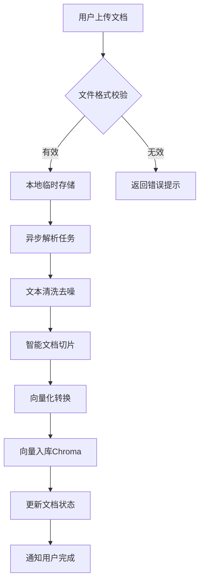
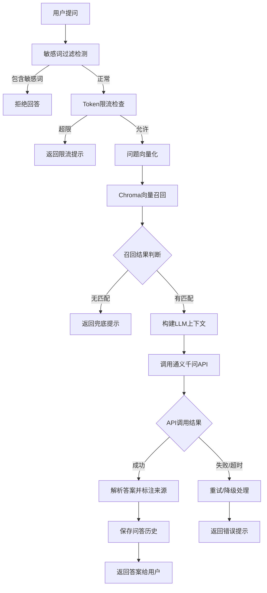
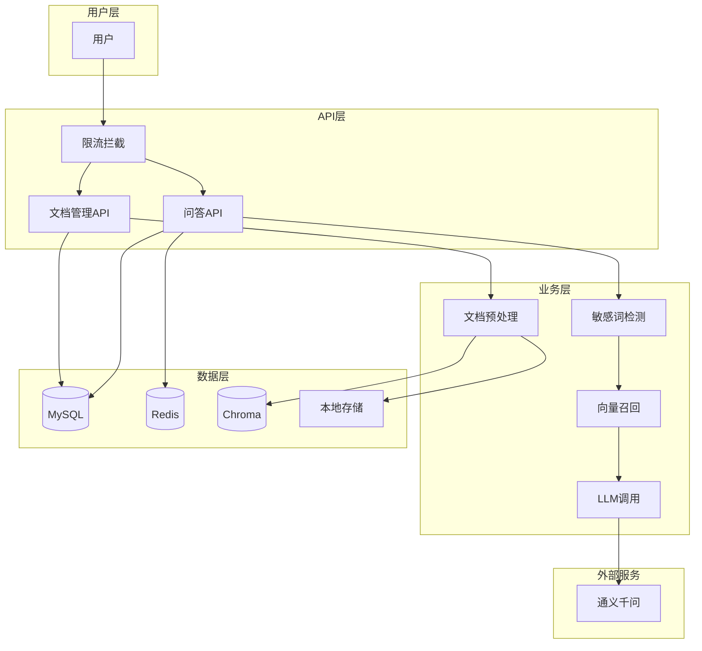
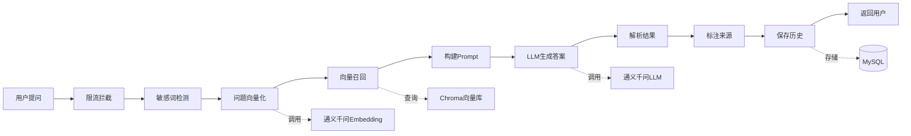
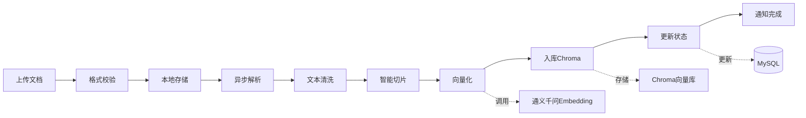
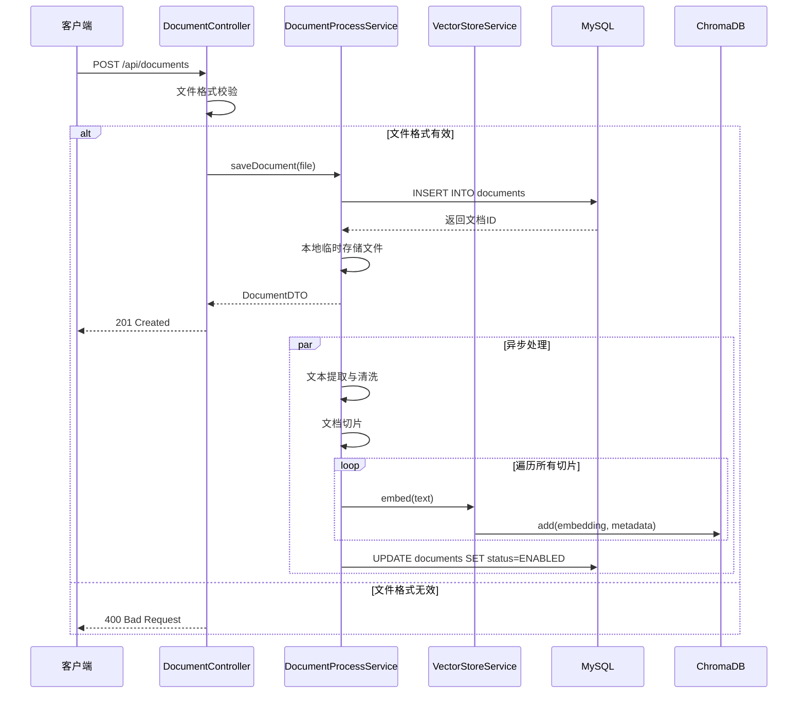
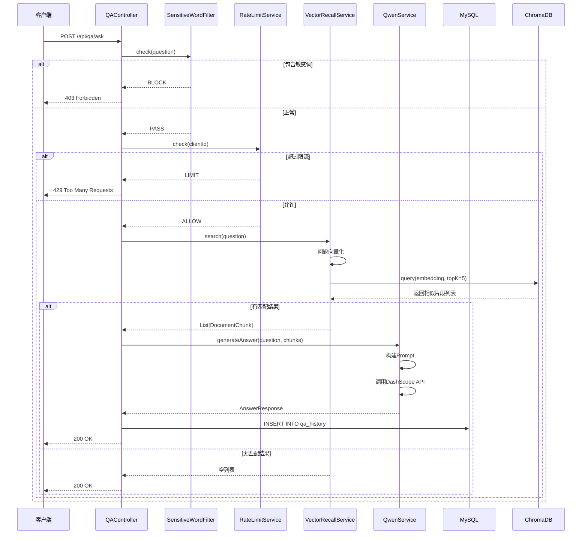

# RAG业务流程图

## 1. 文档上传与预处理流程

```mermaid
flowchart TD
    A[用户上传文档] --> B{文件格式校验}
    B -->|有效| C[本地临时存储]
    B -->|无效| D[返回错误提示]
    C --> E[异步解析任务]
    E --> F[文本清洗去噪]
    F --> G[智能文档切片]
    G --> H[向量化转换]
    H --> I[向量入库Chroma]
    I --> J[更新文档状态]
    J --> K[通知用户完成]
```

## 2. 智能问答全链路流程

```mermaid
flowchart TD
    A[用户提问] --> B[敏感词过滤检测]
    B -->|包含敏感词| C[拒绝回答]
    B -->|正常| D[Token限流检查]
    D -->|超限| E[返回限流提示]
    D -->|允许| F[问题向量化]
    F --> G[Chroma向量召回]
    G --> H{召回结果判断}
    H -->|无匹配| I[返回兜底提示]
    H -->|有匹配| J[构建LLM上下文]
    J --> K[调用通义千问API]
    K --> L{API调用结果}
    L -->|成功| M[解析答案并标注来源]
    L -->|失败/超时| N[重试/降级处理]
    M --> O[保存问答历史]
    O --> P[返回答案给用户]
    N --> Q[返回错误提示]
```

## 3. RAG系统架构图

### 3.1 分层架构概览

```mermaid
flowchart TB
    subgraph 用户层
        U[用户]
    end
    
    subgraph API层
        A1[文档管理API]
        A2[问答API]
        A3[限流拦截]
    end
    
    subgraph 业务层
        B1[文档预处理]
        B2[向量召回]
        B3[LLM调用]
        B4[敏感词检测]
    end
    
    subgraph 数据层
        D1[(MySQL)]
        D2[(Redis)]
        D3[(Chroma)]
        D4[本地存储]
    end
    
    subgraph 外部服务
        E1[通义千问]
    end
    
    U --> A3
    A3 --> A1
    A3 --> A2
    A1 --> B1
    A2 --> B4
    B4 --> B2
    B2 --> B3
    B3 --> E1
    B1 --> D4
    B1 --> D3
    A1 --> D1
    A2 --> D1
    A2 --> D2
```

### 3.2 问答核心数据流

```mermaid
flowchart LR
    %% 请求流
    A[用户提问] --> B[限流拦截]
    B --> C[敏感词检测]
    C --> D[问题向量化]
    D --> E[向量召回]
    E --> F[构建Prompt]
    F --> G[LLM生成答案]
    
    %% 响应流
    G --> H[解析结果]
    H --> I[标注来源]
    I --> J[保存历史]
    J --> K[返回用户]
    
    %% 外部依赖
    D -.->|调用| L[通义千问Embedding]
    E -.->|查询| M[Chroma向量库]
    G -.->|调用| N[通义千问LLM]
    J -.->|存储| O[(MySQL)]
```

### 3.3 文档处理数据流

```mermaid
flowchart LR
    %% 上传流程
    A[上传文档] --> B[格式校验]
    B --> C[本地存储]
    C --> D[异步解析]
    D --> E[文本清洗]
    E --> F[智能切片]
    F --> G[向量化]
    G --> H[入库Chroma]
    H --> I[更新状态]
    I --> J[通知完成]
    
    %% 外部依赖
    G -.->|调用| K[通义千问Embedding]
    H -.->|存储| L[Chroma向量库]
    I -.->|更新| M[(MySQL)]
```

## 4. 文档预处理时序图

```mermaid
sequenceDiagram
    participant Client as 客户端
    participant API as DocumentController
    participant Service as DocumentProcessService
    participant Vector as VectorStoreService
    participant DB as MySQL
    participant Chroma as ChromaDB
    Client->>API: POST /api/documents
    API->>API: 文件格式校验
    alt 文件格式有效
        API->>Service: saveDocument(file)
        Service->>DB: INSERT INTO documents
        DB-->>Service: 返回文档ID
        Service->>Service: 本地临时存储文件
        Service-->>API: DocumentDTO
        API-->>Client: 201 Created
        par 异步处理
            Service->>Service: 文本提取与清洗
            Service->>Service: 文档切片
            loop 遍历所有切片
                Service->>Vector: embed(text)
                Vector->>Chroma: add(embedding, metadata)
            end
            Service->>DB: UPDATE documents SET status=ENABLED
        end
    else 文件格式无效
        API-->>Client: 400 Bad Request
    end
```

## 5. 问答流程时序图

```mermaid
sequenceDiagram
    participant Client as 客户端
    participant API as QAController
    participant Filter as SensitiveWordFilter
    participant RateLimit as RateLimitService
    participant Recall as VectorRecallService
    participant LLM as QwenService
    participant DB as MySQL
    participant Chroma as ChromaDB
    Client->>API: POST /api/qa/ask
    API->>Filter: check(question)
    alt 包含敏感词
        Filter-->>API: BLOCK
        API-->>Client: 403 Forbidden
    else 正常
        Filter-->>API: PASS
        API->>RateLimit: check(clientId)
        alt 超过限流
            RateLimit-->>API: LIMIT
            API-->>Client: 429 Too Many Requests
        else 允许
            RateLimit-->>API: ALLOW
            API->>Recall: search(question)
            Recall->>Recall: 问题向量化
            Recall->>Chroma: query(embedding, topK=5)
            Chroma-->>Recall: 返回相似片段列表
            alt 有匹配结果
                Recall-->>API: List[DocumentChunk]
                API->>LLM: generateAnswer(question, chunks)
                LLM->>LLM: 构建Prompt
                LLM->>LLM: 调用DashScope API
                LLM-->>API: AnswerResponse
                API->>DB: INSERT INTO qa_history
                API-->>Client: 200 OK
            else 无匹配结果
                Recall-->>API: 空列表
                API-->>Client: 200 OK
            end
        end
    end
```
