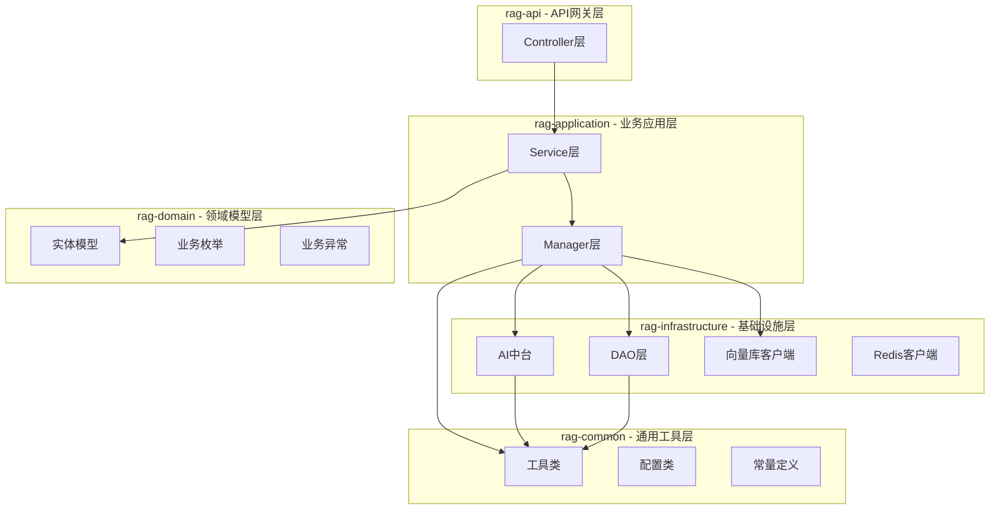
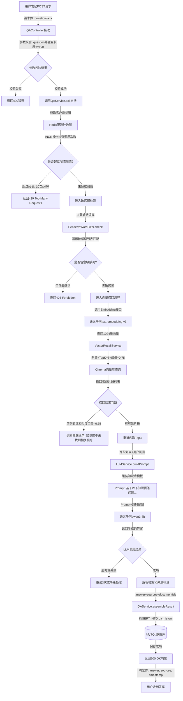
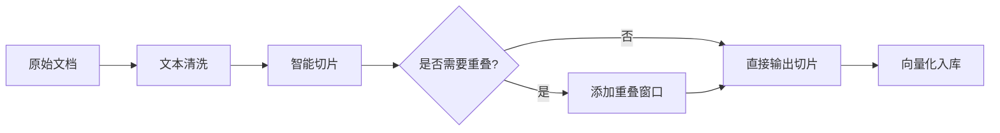
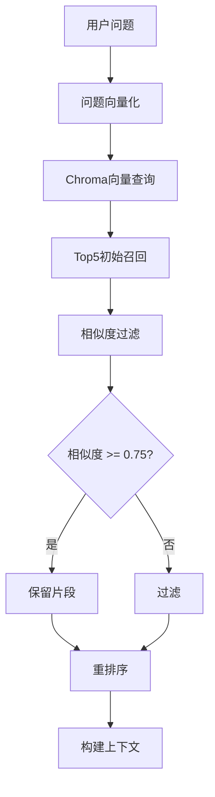
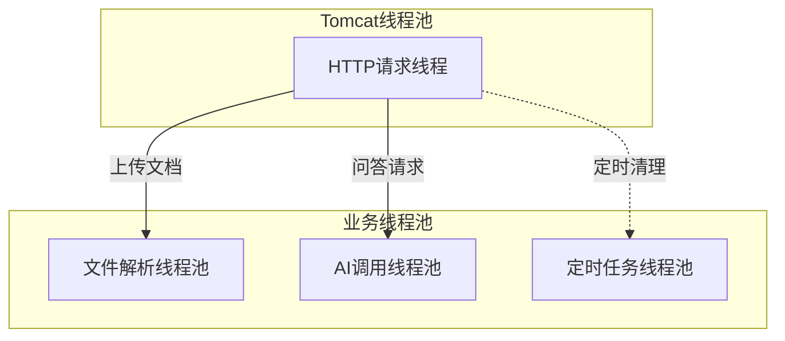
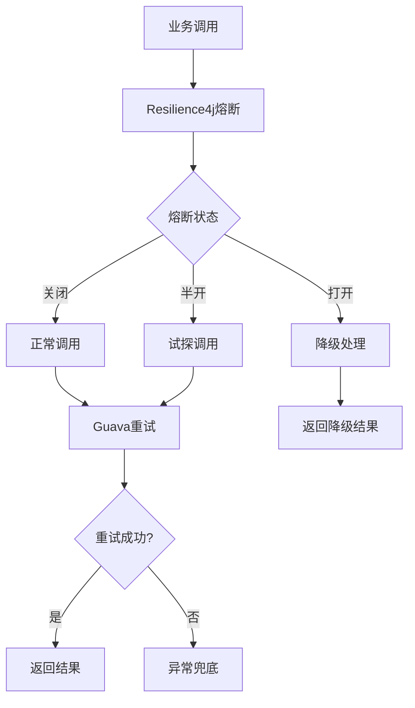

# 企业级RAG文档问答系统 - 架构设计文档

## 1. 架构概述

### 1.1 架构目标
本系统采用企业级标准分层架构，实现RAG（Retrieval-Augmented Generation）文档问答功能，具备高可用性、可扩展性和可维护性。

### 1.2 设计原则
- **分层解耦**：严格遵循 Controller → Service → Manager → DAO 的分层原则
- **单一职责**：每个模块职责清晰，避免跨层调用
- **可扩展性**：预留接口和抽象层，支持未来功能扩展
- **容错优先**：内置熔断、重试、降级机制

---

## 2. 多模块依赖架构

### 2.1 模块划分



### 2.2 模块职责说明

| 模块 | 职责 | 包含内容 |
| :--- | :--- | :--- |
| **rag-api** | REST API入口 | Controller、全局异常处理 |
| **rag-application** | 业务逻辑层 | Service、Manager、DTO/VO、业务编排 |
| **rag-domain** | 领域模型 | Entity、Enum、BusinessException |
| **rag-infrastructure** | 基础设施 | DAO、AI中台、向量库、Redis |
| **rag-common** | 通用工具 | Util、Config、Constants |

> **注意**：DTO/VO类放置在`rag-application`模块而非`rag-api`模块，避免循环依赖问题。
> 正确的依赖关系：`rag-api → rag-application → rag-domain → rag-infrastructure → rag-common`

### 2.3 分层架构详细设计

#### 2.3.1 Controller层
- **职责**：接收HTTP请求，参数校验，调用Service，返回响应
- **规范**：不包含业务逻辑，仅做参数传递和响应封装
- **示例**：DocumentController、QAController、HealthController

#### 2.3.2 Service层
- **职责**：核心业务逻辑处理，事务管理
- **规范**：事务边界在此层定义，避免跨Service调用
- **示例**：DocumentService、QAService、SensitiveWordService

#### 2.3.3 Manager层
- **职责**：**中台封装层**，封装外部依赖调用，提供统一的业务能力接口
- **规范**：
  - 统一封装AI调用、向量库操作、Redis操作
  - 对外提供业务友好的接口，隐藏底层实现细节
  - 集中处理外部调用的容错、重试、熔断逻辑
- **示例**：AIManager、VectorStoreManager、RedisManager
- **核心优势**：
  1. **解耦业务与底层实现**：Service层无需关心具体技术实现
  2. **统一收口**：外部依赖调用统一管理，便于监控和治理
  3. **容错集中**：熔断、重试等容错逻辑集中在Manager层
  4. **易于替换**：底层实现变更不影响业务层

**Manager层与Service层的分工**：
| 层级 | 职责 | 关注点 |
| :--- | :--- | :--- |
| **Service层** | 业务逻辑编排、事务管理 | 业务规则、流程控制 |
| **Manager层** | 外部依赖封装、能力提供 | 技术实现、容错处理 |

**Manager层设计模式**：
- **门面模式**：提供统一入口，屏蔽底层复杂性
- **策略模式**：支持多种实现切换（如多LLM模型切换）
- **适配器模式**：统一不同外部服务的接口规范

#### 2.3.4 DAO层
- **职责**：数据访问层，与数据库交互
- **规范**：使用MyBatis-Plus，避免复杂SQL逻辑
- **示例**：DocumentDao、QA HistoryDao

#### 2.3.5 CoreAI层（技术实现层）
- **职责**：**AI能力具体实现**，定义接口规范，实现各厂商API调用
- **规范**：
  - 定义抽象接口（LLMService、EmbeddingService）
  - 各厂商具体实现类（QwenLLMService、OpenAILLMService等）
  - 封装API调用、参数构建、响应解析等技术细节
- **示例**：
  - LLMService接口 → QwenLLMService实现
  - EmbeddingService接口 → QwenEmbeddingService实现
- **设计模式**：抽象接口 + 多实现类（策略模式的技术实现）

#### 2.3.6 Manager层与CoreAI层的区别

| 层级 | 定位 | 多模型切换的实现方式 | 职责 |
| :--- | :--- | :--- | :--- |
| **CoreAI层** | **技术实现层** | 定义接口 + 各厂商实现类 | 实现具体的模型调用逻辑 |
| **Manager层** | **业务封装层** | 策略选择 + 容错处理 | 选择使用哪个模型实现 |

**调用链路示意**：
```
QAService（业务编排）
    ↓ 调用
AIManager（策略选择 + 容错）
    ↓ 通过配置注入
LLMService接口（抽象接口）
    ↓ 具体实现
QwenLLMService（通义千问API调用）
```

**CoreAI层职责**：
- 定义 `LLMService` 接口
- 实现 `QwenLLMService`（通义千问）、`OpenAILLMService`（OpenAI）等
- 封装API调用细节、参数构建、响应解析

**Manager层职责**：
- 通过Spring配置选择注入哪个LLMService实现
- 提供统一的业务接口 `embed()`、`generate()`
- 内置熔断、重试、降级等容错逻辑

**总结**：CoreAI层负责"实现"多模型能力，Manager层负责"选择"多模型策略。

---

## 3. RAG链路架构

### 3.1 RAG全链路详细流程图



### 3.2 RAG全链路详细步骤说明

#### 第1步：用户发起请求
| 项目 | 内容 |
| :--- | :--- |
| **触发时机** | 用户在界面输入问题，点击提交按钮 |
| **请求方式** | POST /api/qa/ask |
| **请求体** | `{"question": "什么是RAG架构?"}` |
| **进入下一层条件** | HTTP请求到达Controller |

#### 第2步：Controller层处理
| 项目 | 内容 |
| :--- | :--- |
| **触发时机** | Spring MVC路由匹配到QAController |
| **处理逻辑** | 参数校验：question非空、长度<=500字符 |
| **校验失败结果** | 返回400 Bad Request，提示"参数错误" |
| **校验成功结果** | 调用QAService.ask(question) |
| **进入下一层条件** | 参数校验通过 |

#### 第3步：限流检查（RedisManager调用）
| 项目 | 内容 |
| :--- | :--- |
| **触发时机** | QAService调用 **RedisManager.checkRateLimit(clientId)** |
| **处理逻辑** | RedisManager封装：获取Redis连接 → INCR计数器 → 判断阈值 |
| **限流阈值** | 10次/分钟（单用户） |
| **超过阈值结果** | 返回RateLimitResult(false) |
| **未超过阈值结果** | 返回RateLimitResult(true) |
| **进入下一层条件** | 限流检查通过 |
| **Manager层作用** | 封装Redis操作细节，提供业务友好接口 |

#### 第4步：敏感词检测
| 项目 | 内容 |
| :--- | :--- |
| **触发时机** | QAService调用SensitiveWordFilter.check(question) |
| **处理逻辑** | 遍历敏感词库，检查问题是否包含敏感词 |
| **敏感词来源** | 配置文件或数据库预置 |
| **包含敏感词结果** | 返回403 Forbidden，提示"内容违规" |
| **无敏感词结果** | 继续执行向量召回 |
| **进入下一层条件** | 无敏感词 |

#### 第5步：问题向量化（AIManager调用）
| 项目 | 内容 |
| :--- | :--- |
| **触发时机** | QAService调用 **AIManager.embed(question)** |
| **调用目标** | AIManager内部调用通义千问 text-embedding-v3 模型 |
| **输入内容** | 用户原始问题文本 |
| **输出结果** | 1024维浮点数向量 |
| **进入下一层条件** | 向量化成功 |
| **Manager层作用** | 封装LLM调用细节，支持多模型切换，内置熔断重试 |

#### 第6步：向量召回（VectorStoreManager调用）
| 项目 | 内容 |
| :--- | :--- |
| **触发时机** | QAService调用 **VectorStoreManager.search(embedding)** |
| **查询参数** | 向量 + TopK=5 + 相似度阈值=0.75 |
| **查询目标** | VectorStoreManager内部查询Chroma向量库 |
| **输出结果** | 相似片段列表，包含：content, similarity, documentId |
| **召回失败结果** | 空列表或相似度全部<0.75 |
| **召回成功结果** | 至少1个片段相似度>=0.75 |
| **进入下一层条件** | 有有效召回片段 |
| **Manager层作用** | 封装向量库操作，屏蔽底层存储差异，统一召回接口 |

#### 第7步：构建Prompt
| 项目 | 内容 |
| :--- | :--- |
| **触发时机** | QAService调用LLMService.buildPrompt |
| **输入内容** | 用户问题 + 召回的知识库片段（Top3） |
| **Prompt模板** | 知识库问答模板，强约束LLM仅依托知识库作答 |
| **输出结果** | 完整Prompt字符串 |
| **进入下一层条件** | Prompt构建完成 |

#### 第8步：调用LLM（AIManager调用）
| 项目 | 内容 |
| :--- | :--- |
| **触发时机** | QAService调用 **AIManager.generate(prompt)** |
| **调用目标** | AIManager内部调用通义千问 qwen3-8b 模型 |
| **输入内容** | 构建好的Prompt |
| **超时配置** | connectTimeout=15s, readTimeout=30s |
| **调用失败结果** | 超时或网络异常，触发重试（最多3次） |
| **调用成功结果** | 返回生成的答案文本 |
| **进入下一层条件** | LLM调用成功 |
| **Manager层作用** | 封装LLM调用细节，内置熔断重试，统一错误处理 |

#### 第9步：结果组装
| 项目 | 内容 |
| :--- | :--- |
| **触发时机** | QAService.assembleResult |
| **输入内容** | LLM答案 + 来源文档信息 |
| **处理逻辑** | 解析答案，标注引用的文档来源 |
| **输出结果** | 完整响应对象：answer, sources, documentIds |
| **进入下一层条件** | 结果组装完成 |

#### 第10步：保存历史
| 项目 | 内容 |
| :--- | :--- |
| **触发时机** | QAService调用QAHistoryDao.save |
| **保存内容** | question, answer, sources, timestamp, userId |
| **保存目标** | MySQL数据库 qa_history 表 |
| **输出结果** | 历史记录ID |
| **进入下一层条件** | 保存成功 |

#### 第11步：返回响应
| 项目 | 内容 |
| :--- | :--- |
| **触发时机** | QAService返回结果给Controller |
| **响应状态** | 200 OK |
| **响应体** | `{"answer": "...", "sources": [...], "timestamp": "..."}` |
| **最终结果** | 用户在界面看到答案和来源标注 |

### 3.3 信息流动总结

```
用户问题(question) 
    → Controller校验 
    → Service限流检查 
    → 敏感词过滤 
    → Embedding向量化(1024维向量) 
    → Chroma召回(相似片段列表) 
    → Prompt构建(完整Prompt) 
    → LLM生成(答案文本) 
    → 结果组装(answer+sources) 
    → MySQL保存(历史记录) 
    → 返回用户(完整响应)
```

### 3.4 关键判断节点

| 判断节点 | 判断条件 | 分支A结果 | 分支B结果 |
| :--- | :--- | :--- | :--- |
| **参数校验** | question非空且长度<=500 | 继续执行 | 返回400错误 |
| **限流检查** | 调用次数<=10次/分钟 | 继续执行 | 返回429错误 |
| **敏感词检测** | 不包含敏感词 | 继续执行 | 返回403错误 |
| **召回结果** | 相似度>=0.75的片段>=1个 | 继续执行 | 返回兜底提示 |
| **LLM调用** | 调用成功或重试成功 | 继续执行 | 返回降级提示 |

---

## 4. 切片优化方案

### 4.1 切片策略设计



### 4.2 切片参数配置

| 参数 | 值 | 说明 |
| :--- | :--- | :--- |
| **chunk-size** | 512 | 切片大小（字符数） |
| **chunk-overlap** | 120 | 重叠窗口大小（字符数） |
| **min-chunk-size** | 100 | 最小切片长度 |
| **max-chunk-size** | 1024 | 最大切片长度 |

### 4.3 切片算法实现

**核心逻辑**：
1. **文本清洗**：去除多余空格、水印、特殊字符
2. **智能切分**：按标点符号（。！？）进行切分
3. **窗口重叠**：相邻切片保留120字符重叠，解决上下文割裂问题
4. **长度校验**：确保切片长度在合理范围内

**优势分析**：
- **512字符**：匹配通义千问模型的上下文窗口，保证语义完整性
- **120字符重叠**：避免上下文断裂，提升召回准确性
- **智能切分**：按语义边界切分，保持语句完整性

---

## 5. 召回调优方案

### 5.1 召回策略设计



### 5.2 召回参数配置

| 参数 | 值 | 说明 |
| :--- | :--- | :--- |
| **similarity-threshold** | 0.75 | 相似度阈值，低于此值过滤 |
| **recall-top-num** | 5 | 初始召回数量 |
| **final-top-num** | 3 | 最终用于构建上下文的数量 |

### 5.3 重排序机制

**重排序策略**：
1. **相似度排序**：按向量相似度从高到低排序
2. **位置加权**：文档开头片段权重稍高
3. **长度过滤**：过短片段（<100字符）优先级降低
4. **去重处理**：合并高度相似的片段

**兜底机制**：
- 当召回结果全部低于阈值时，返回"知识库中未找到相关信息"
- 避免大模型凭空编造答案

---

## 6. 线程池隔离方案

### 6.1 线程池设计



### 6.2 线程池配置

| 线程池名称 | 核心线程数 | 最大线程数 | 队列容量 | 场景 |
| :--- | :--- | :--- | :--- | :--- |
| **fileParserThreadPool** | 4 | 8 | 100 | 文件解析、向量化 |
| **aiCallThreadPool** | 4 | 8 | 50 | LLM调用、Embedding |
| **scheduledThreadPool** | 2 | 2 | - | 定时任务 |

### 6.3 线程池隔离优势

1. **资源隔离**：文件解析不占用问答线程
2. **优先级控制**：问答请求优先处理
3. **OOM防护**：独立线程池避免相互影响
4. **监控便利**：便于监控各业务线执行情况

---

## 7. 熔断重试方案

### 7.1 容错架构



### 7.2 熔断配置

| 参数 | 值 | 说明 |
| :--- | :--- | :--- |
| **failure-rate-threshold** | 50% | 失败率阈值 |
| **wait-duration-in-open-state** | 30s | 熔断打开时长 |
| **permitted-number-of-calls-in-half-open-state** | 5 | 半开状态允许调用数 |

### 7.3 重试配置

| 参数 | 值 | 说明 |
| :--- | :--- | :--- |
| **max-retry** | 3 | 最大重试次数 |
| **initial-interval** | 100ms | 初始重试间隔 |
| **multiplier** | 2.0 | 间隔倍增系数 |
| **max-interval** | 1000ms | 最大重试间隔 |

### 7.4 分级异常兜底

| 异常类型 | 兜底策略 | 返回结果 |
| :--- | :--- | :--- |
| **LLM调用超时** | 重试3次后降级 | "系统繁忙，请稍后重试" |
| **向量库异常** | 直接降级 | "知识库服务暂不可用" |
| **网络异常** | 重试+降级 | "网络异常，请检查网络连接" |
| **参数错误** | 直接返回 | "参数错误，请检查输入" |

---

## 8. 技术选型对比

### 8.1 原生Prompt问答 vs RAG问答

| 维度 | 原生Prompt问答 | RAG问答 |
| :--- | :--- | :--- |
| **知识来源** | 模型训练数据 | 用户上传文档 |
| **时效性** | 截止训练时间 | 实时更新 |
| **准确性** | 可能产生幻觉 | 基于文档，准确性高 |
| **可溯源** | 无法追溯来源 | 标注引用文档来源 |
| **适用场景** | 通用知识问答 | 企业知识库问答 |
| **上下文限制** | 受模型窗口限制 | 可扩展知识库 |
| **部署复杂度** | 简单 | 需部署向量库 |
| **成本** | 较低 | 较高（向量库+LLM） |

### 8.2 向量库选型对比

| 维度 | Chroma | Milvus |
| :--- | :--- | :--- |
| **部署方式** | 本地嵌入式 | 分布式集群 |
| **扩展性** | 有限 | 水平扩展 |
| **并发支持** | 中等 | 高 |
| **学习成本** | 低 | 高 |
| **运维成本** | 低 | 高 |
| **适用场景** | 小规模、本地部署 | 大规模、生产环境 |

### 8.3 大模型选型对比

| 维度 | 通义千问 | GPT |
| :--- | :--- | :--- |
| **访问方式** | 国内API | 需翻墙 |
| **响应速度** | 较快 | 中等 |
| **中文支持** | 优秀 | 良好 |
| **价格** | 相对较低 | 较高 |
| **合规性** | 国内合规 | 数据出境风险 |

---

## 9. 关键设计决策

### 9.1 架构决策记录

| 决策项 | 方案 | 理由 |
| :--- | :--- | :--- |
| **语言选择** | Java 21 LTS | LTS版本稳定，性能优秀，生态成熟 |
| **框架选择** | Spring Boot 3.3.x | 社区成熟，生态完善，便于快速开发 |
| **向量库** | Chroma（本地） | MVP阶段本地部署，降低复杂度 |
| **大模型** | 通义千问 | 国内访问稳定，中文支持好 |
| **数据库** | MySQL + Redis | 成熟稳定，满足业务需求 |

### 9.2 面试高频问题准备

#### Q1：为什么选择RAG架构？
**答**：RAG架构能够将外部知识库与大模型结合，解决传统LLM的幻觉问题，保证回答的准确性和可溯源性，特别适合企业知识库问答场景。

#### Q2：切片策略的设计考虑？
**答**：采用512字符切片+120字符重叠窗口，既能保证每个切片语义完整，又能避免上下文割裂，提升召回准确性。

#### Q3：线程池隔离的目的？
**答**：将文件解析、AI调用等耗时操作与HTTP请求线程隔离，防止长时间任务阻塞Tomcat线程，保证系统稳定性。

#### Q4：容错体系如何设计？
**答**：采用Resilience4j熔断+Guava重试+分级异常兜底三层防护，确保在各种异常场景下系统都能优雅降级。

---

## 10. 安全设计

### 10.1 API密钥管理
- 通义千问API密钥通过环境变量注入
- 禁止硬编码密钥到配置文件或代码中
- 使用`${aliQwen-api}`方式引用环境变量

### 10.2 数据保护
- 文档本地存储，不传输至外部服务
- 向量数据仅存储在本地Chroma实例
- 敏感词过滤防止违规内容

---

**文档版本**: v1.0  
**创建日期**: 2026-06-18  
**适用面试等级**: 4年Java开发
