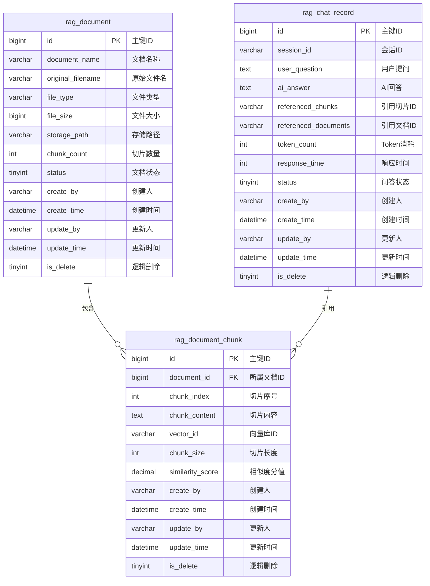
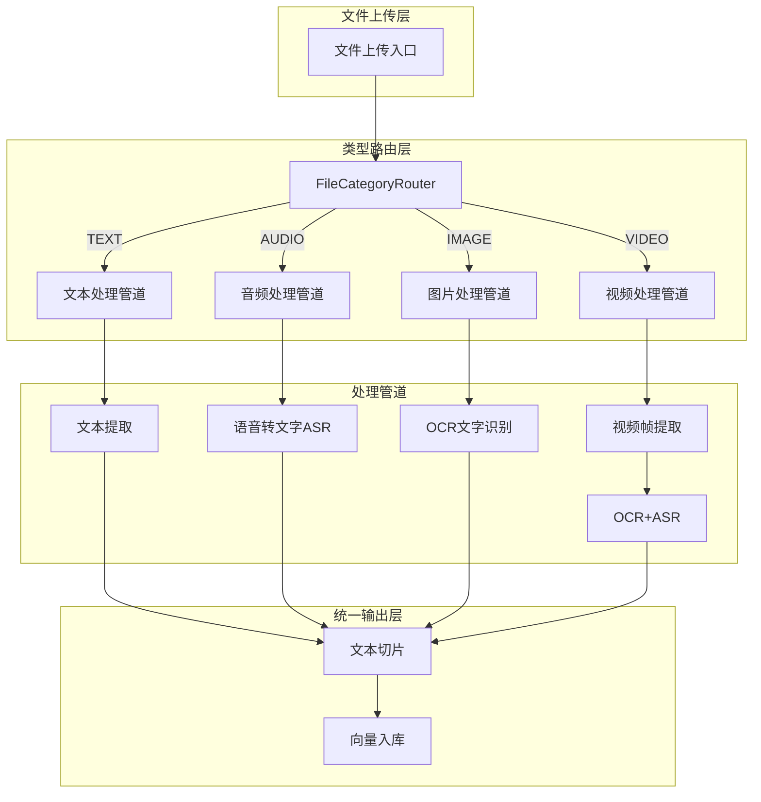

# 企业级RAG文档问答系统 - 数据库设计文档

## 1. 设计概述

### 1.1 设计原则
- **极简三表**：仅设计三张核心业务表，避免冗余
- **审计字段**：所有表统一包含审计字段，满足企业规范
- **业务索引**：针对高频查询字段建立B+索引
- **枚举状态**：状态字段全部使用枚举类，杜绝硬编码

### 1.2 表结构概览

| 表名 | 中文名 | 核心职责 |
| :--- | :--- | :--- |
| **rag_document** | 文档表 | 存储文档基础信息、状态、存储路径 |
| **rag_document_chunk** | 文档切片表 | 存储切片内容、向量关联、所属文档 |
| **rag_chat_record** | 问答记录表 | 存储用户提问、AI回答、引用切片 |

---

## 2. 表结构详细设计

### 2.1 文档表（rag_document）

**表职责**：存储上传文档的基础信息，管理文档生命周期状态

| 字段名 | 类型 | 长度 | 必填 | 默认值 | 说明 |
| :--- | :--- | :--- | :--- | :--- | :--- |
| id | BIGINT | - | Y | 自增 | 主键ID |
| document_name | VARCHAR | 255 | Y | - | 文档名称 |
| original_filename | VARCHAR | 255 | Y | - | 原始文件名 |
| file_type | VARCHAR | 20 | Y | - | 文件类型（PDF/TXT/DOCX） |
| file_size | BIGINT | - | Y | - | 文件大小（字节） |
| storage_path | VARCHAR | 500 | Y | - | 本地存储路径 |
| chunk_count | INT | - | N | 0 | 切片数量 |
| status | TINYINT | - | Y | 0 | 文档状态（枚举） |
| create_by | VARCHAR | 64 | N | system | 创建人 |
| create_time | DATETIME | - | N | CURRENT_TIMESTAMP | 创建时间 |
| update_by | VARCHAR | 64 | N | system | 更新人 |
| update_time | DATETIME | - | N | CURRENT_TIMESTAMP | 更新时间 |
| is_delete | TINYINT | - | N | 0 | 逻辑删除标记 |

**索引设计**：
| 索引名 | 索引字段 | 索引类型 | 说明 |
| :--- | :--- | :--- | :--- |
| PRIMARY | id | 主键 | 主键索引 |
| idx_status | status | 普通 | 按状态查询文档 |
| idx_create_time | create_time | 普通 | 按时间排序查询 |
| idx_document_name | document_name | 普通 | 按名称模糊查询 |

---

### 2.2 文档切片表（rag_document_chunk）

**表职责**：存储文档切片内容，关联向量库ID，支持召回查询

| 字段名 | 类型 | 长度 | 必填 | 默认值 | 说明 |
| :--- | :--- | :--- | :--- | :--- | :--- |
| id | BIGINT | - | Y | 自增 | 主键ID |
| document_id | BIGINT | - | Y | - | 所属文档ID（外键） |
| chunk_index | INT | - | Y | - | 切片序号（从0开始） |
| chunk_content | TEXT | - | Y | - | 切片内容 |
| vector_id | VARCHAR | 64 | N | - | Chroma向量库ID |
| chunk_size | INT | - | Y | - | 切片长度（字符数） |
| similarity_score | DECIMAL | 5,4 | N | 0.0000 | 相似度分值 |
| create_by | VARCHAR | 64 | N | system | 创建人 |
| create_time | DATETIME | - | N | CURRENT_TIMESTAMP | 创建时间 |
| update_by | VARCHAR | 64 | N | system | 更新人 |
| update_time | DATETIME | - | N | CURRENT_TIMESTAMP | 更新时间 |
| is_delete | TINYINT | - | N | 0 | 逻辑删除标记 |

**索引设计**：
| 索引名 | 索引字段 | 索引类型 | 说明 |
| :--- | :--- | :--- | :--- |
| PRIMARY | id | 主键 | 主键索引 |
| idx_document_id | document_id | 普通 | 按文档ID查询切片 |
| idx_vector_id | vector_id | 普通 | 按向量ID查询切片 |
| idx_chunk_index | document_id, chunk_index | 联合 | 按文档+序号定位切片 |

---

### 2.3 问答记录表（rag_chat_record）

**表职责**：存储用户问答历史，记录引用切片和Token消耗

| 字段名 | 类型 | 长度 | 必填 | 默认值 | 说明 |
| :--- | :--- | :--- | :--- | :--- | :--- |
| id | BIGINT | - | Y | 自增 | 主键ID |
| session_id | VARCHAR | 64 | Y | - | 会话ID |
| user_question | TEXT | - | Y | - | 用户提问内容 |
| ai_answer | TEXT | - | N | - | AI回答内容 |
| referenced_chunks | VARCHAR | 500 | N | - | 引用切片ID列表（JSON） |
| referenced_documents | VARCHAR | 500 | N | - | 引用文档ID列表（JSON） |
| token_count | INT | - | N | 0 | 消耗Token数量 |
| response_time | INT | - | N | 0 | 响应时间（毫秒） |
| status | TINYINT | - | Y | 0 | 问答状态（枚举） |
| create_by | VARCHAR | 64 | N | system | 创建人 |
| create_time | DATETIME | - | N | CURRENT_TIMESTAMP | 创建时间 |
| update_by | VARCHAR | 64 | N | system | 更新人 |
| update_time | DATETIME | - | N | CURRENT_TIMESTAMP | 更新时间 |
| is_delete | TINYINT | - | N | 0 | 逻辑删除标记 |

**索引设计**：
| 索引名 | 索引字段 | 索引类型 | 说明 |
| :--- | :--- | :--- | :--- |
| PRIMARY | id | 主键 | 主键索引 |
| idx_session_id | session_id | 普通 | 按会话ID查询历史 |
| idx_create_time | create_time | 普通 | 按时间排序查询 |
| idx_status | status | 普通 | 按状态查询问答记录 |

---

## 3. 业务枚举设计

### 3.1 文档状态枚举（DocumentStatusEnum）

| 枚举值 | 编码 | 说明 | 业务场景 |
| :--- | :--- | :--- | :--- |
| UPLOADING | 0 | 上传中 | 文档正在上传 |
| PROCESSING | 1 | 处理中 | 文档正在解析切片 |
| ENABLED | 2 | 已启用 | 文档可用，参与召回 |
| DISABLED | 3 | 已禁用 | 文档禁用，不参与召回 |
| FAILED | 4 | 处理失败 | 文档处理异常 |

### 3.2 文件类型枚举（FileTypeEnum）

**设计考虑**：预留多模态扩展槽位，当前仅支持文本类，预留语音、图片、视频等扩展支持。

| 枚举值 | 编码 | 说明 | 支持格式 | 分类 | 当前状态 |
| :--- | :--- | :--- | :--- | :--- | :--- |
| PDF | PDF | PDF文档 | .pdf | TEXT | ✅ 当前支持 |
| TXT | TXT | 纯文本 | .txt | TEXT | ✅ 当前支持 |
| DOCX | DOCX | Word文档 | .docx | TEXT | ✅ 当前支持 |
| MP3 | MP3 | MP3音频 | .mp3 | AUDIO | ⏳ 预留扩展 |
| WAV | WAV | WAV音频 | .wav | AUDIO | ⏳ 预留扩展 |
| JPG | JPG | JPEG图片 | .jpg | IMAGE | ⏳ 预留扩展 |
| PNG | PNG | PNG图片 | .png | IMAGE | ⏳ 预留扩展 |
| MP4 | MP4 | MP4视频 | .mp4 | VIDEO | ⏳ 预留扩展 |
| OTHER | OTHER | 其他格式 | .other | OTHER | ⏳ 预留扩展 |

### 3.2.1 文件分类枚举（FileCategory）

**设计目的**：用于多模态处理路由，将文件类型归类到不同处理管道。

| 枚举值 | 编码 | 名称 | 处理方式 | 当前支持 |
| :--- | :--- | :--- | :--- | :--- |
| TEXT | TEXT | 文本类 | 直接提取文本内容 | ✅ 是 |
| AUDIO | AUDIO | 音频类 | 语音转文字（ASR） | ⏳ 预留 |
| IMAGE | IMAGE | 图片类 | OCR文字识别 | ⏳ 预留 |
| VIDEO | VIDEO | 视频类 | 视频转文字 | ⏳ 预留 |
| OTHER | OTHER | 其他类 | 自定义处理 | ⏳ 预留 |

### 3.3 问答状态枚举（ChatStatusEnum）

| 枚举值 | 编码 | 说明 | 业务场景 |
| :--- | :--- | :--- | :--- |
| PENDING | 0 | 待处理 | 问题已提交，等待处理 |
| SUCCESS | 1 | 成功 | 问答成功完成 |
| NO_MATCH | 2 | 无匹配 | 知识库无匹配结果 |
| FILTERED | 3 | 已过滤 | 敏感词过滤拒绝 |
| RATE_LIMITED | 4 | 限流 | 超过限流阈值拒绝 |
| FAILED | 5 | 失败 | 问答处理异常 |

---

## 4. 数据库设计规范

### 4.1 字段命名规范
- **主键**：统一使用 `id`，BIGINT类型，自增
- **外键**：使用 `xxx_id` 命名，如 `document_id`
- **状态字段**：使用 `status`，TINYINT类型，配合枚举类
- **时间字段**：使用 `xxx_time` 命名，DATETIME类型
- **逻辑删除**：统一使用 `is_delete`，TINYINT类型

### 4.2 审计字段规范
所有业务表必须包含以下审计字段：
```sql
create_by VARCHAR(64) DEFAULT 'system' COMMENT '创建人',
create_time DATETIME DEFAULT CURRENT_TIMESTAMP COMMENT '创建时间',
update_by VARCHAR(64) DEFAULT 'system' COMMENT '更新人',
update_time DATETIME DEFAULT CURRENT_TIMESTAMP ON UPDATE CURRENT_TIMESTAMP COMMENT '更新时间',
is_delete TINYINT DEFAULT 0 COMMENT '逻辑删除标记(0-正常 1-删除)'
```

### 4.3 索引设计规范
- **主键索引**：所有表必须有主键索引
- **外键索引**：外键字段必须建立普通索引
- **高频查询**：高频查询字段建立索引（status、create_time等）
- **联合索引**：多字段组合查询建立联合索引
- **索引命名**：使用 `idx_字段名` 或 `idx_字段1_字段2` 命名

### 4.4 逻辑删除规范
- 使用 `is_delete` 字段标记删除状态
- 0表示正常，1表示已删除
- MyBatis-Plus配置逻辑删除自动处理

---

## 5. ER图



---

## 6. 建表SQL脚本

详见：`rag-infrastructure/src/main/resources/sql/init_tables.sql`

---

## 7. 实体类代码

详见：
- `rag-domain/src/main/java/com/rag/domain/entity/RagDocument.java`
- `rag-domain/src/main/java/com/rag/domain/entity/RagDocumentChunk.java`
- `rag-domain/src/main/java/com/rag/domain/entity/RagChatRecord.java`

---

## 8. 业务枚举代码

详见：
- `rag-domain/src/main/java/com/rag/domain/enums/DocumentStatusEnum.java`
- `rag-domain/src/main/java/com/rag/domain/enums/FileTypeEnum.java`
- `rag-domain/src/main/java/com/rag/domain/enums/ChatStatusEnum.java`

---

## 9. 无登录场景下的会话绑定方案

### 9.1 设计背景

本系统设计为无需登录注册即可使用，通过**会话ID（session_id）**来绑定用户的问答历史记录。

### 9.2 核心设计思路


### 9.3 实现方案

| 步骤 | 操作 | 说明 |
|:---|:---|:---|
| 1 | 前端生成UUID | 用户首次访问时生成唯一标识 |
| 2 | 存储到LocalStorage | 持久化到浏览器，下次访问自动携带 |
| 3 | 请求时携带sessionId | 放在请求头或请求体中 |
| 4 | 后端记录sessionId | 写入rag_chat_record表 |
| 5 | 查询时按sessionId检索 | 获取该用户的所有问答历史 |

### 9.4 前端实现示例

```javascript
function getSessionId() {
    let sessionId = localStorage.getItem('rag_session_id');
    if (!sessionId) {
        sessionId = uuidv4();
        localStorage.setItem('rag_session_id', sessionId);
    }
    return sessionId;
}

fetch('/api/qa/ask', {
    method: 'POST',
    headers: {
        'Content-Type': 'application/json',
        'X-Session-Id': getSessionId()
    },
    body: JSON.stringify({ question: 'xxx' })
});
```

### 9.5 优缺点分析

| 维度 | 优点 | 缺点 |
|:---|:---|:---|
| **匿名性** | 用户无需注册即可使用 | 无法跨设备同步 |
| **简单性** | 实现简单，无需认证系统 | 清除浏览器数据后历史丢失 |
| **隐私性** | 不收集用户身份信息 | 无法识别同一用户的多设备访问 |

### 9.6 备选方案

| 方案 | 描述 | 适用场景 |
|:---|:---|:---|
| **Cookie追踪** | 服务端设置Cookie，有效期较长 | 需要服务器端支持 |
| **设备指纹** | 基于浏览器特征生成唯一标识 | 需要第三方库支持 |
| **邮箱/手机号临时绑定** | 用户输入邮箱接收验证码验证身份 | 需要发送邮件/SMS能力 |

### 9.7 面试问答准备

**Q：无登录场景下如何绑定用户会话？**

**A**：通过前端生成UUID作为session_id，存储在LocalStorage中，每次请求时携带该session_id，后端将问答记录与session_id关联存储。这样既保证了用户匿名使用，又能维护用户的问答历史。

---

## 10. 多模态扩展架构设计

### 10.1 设计背景

当前系统仅支持文本类文档（PDF、TXT、DOCX），但未来可能扩展支持音频、图片、视频等多模态内容。本设计预留扩展槽位，便于后续快速集成。

### 10.2 多模态处理架构



### 10.3 扩展槽位设计

| 扩展点 | 当前实现 | 预留扩展 | 集成方式 |
|:---|:---|:---|:---|
| **文件类型枚举** | FileTypeEnum | 添加新枚举值 | 修改枚举类 |
| **文件分类** | FileCategory | 添加新分类 | 修改枚举类 |
| **处理管道** | 文本处理 | ASR/OCR/视频处理 | 新增Processor类 |
| **配置项** | 文本提取配置 | 多模态服务配置 | 新增配置项 |

### 10.4 扩展集成步骤

**Step 1：添加文件类型枚举**
```java
// 在FileTypeEnum中添加新类型
MP3("MP3", "MP3音频", ".mp3", FileCategory.AUDIO)
```

**Step 2：添加处理管道**
```java
// 实现AudioProcessor接口
public class AudioProcessor implements DocumentProcessor {
    // 调用ASR服务转文字
}
```

**Step 3：注册到路由**
```java
// 在FileCategoryRouter中注册
router.register(FileCategory.AUDIO, new AudioProcessor());
```

### 10.5 预留配置示例

```yaml
# 多模态服务配置（预留）
multimodal:
  asr:
    enabled: false
    endpoint: ${ASR_ENDPOINT}
    api-key: ${ASR_API_KEY}
  ocr:
    enabled: false
    endpoint: ${OCR_ENDPOINT}
    api-key: ${OCR_API_KEY}
  video:
    enabled: false
    frame-interval: 1000
```

### 10.6 面试问答准备

**Q：如何设计支持多模态扩展的文件处理系统？**

**A**：通过三层架构实现：1) 文件类型枚举层：定义FileTypeEnum和FileCategory，预留扩展槽位；2) 类型路由层：根据FileCategory路由到不同处理管道；3) 处理管道层：每种分类独立实现处理逻辑。当前仅实现文本处理，音频、图片、视频等预留扩展，后续只需添加枚举值和处理类即可快速集成。

---

## 11. 注意事项

### 11.1 必填字段说明

**重要**：以下字段在数据库表中设置为NOT NULL且无默认值，代码中必须显式赋值：

| 字段 | 表名 | 说明 | 代码赋值方式 |
|:---|:---|:---|:---|
| **chunk_size** | rag_document_chunk | 切片长度（字符数） | `.chunkSize(chunkContent.length())` |

```java
// ✅ 正确示例：必须显式赋值
RagDocumentChunk chunk = RagDocumentChunk.builder()
        .documentId(documentId)
        .chunkIndex(i)
        .chunkContent(chunkContent)
        .chunkSize(chunkContent.length())  // 必须显式赋值
        .vectorId(vectorId)
        .build();

// ❌ 错误示例：遗漏必填字段
RagDocumentChunk chunk = RagDocumentChunk.builder()
        .documentId(documentId)
        .chunkIndex(i)
        .chunkContent(chunkContent)
        // 遗漏 chunkSize
        .vectorId(vectorId)
        .build();
```

---

**文档版本**: v1.1
**更新日期**: 2026-06-23
**更新内容**: 新增必填字段说明（chunk_size）
**适用面试等级**: 4年Java开发